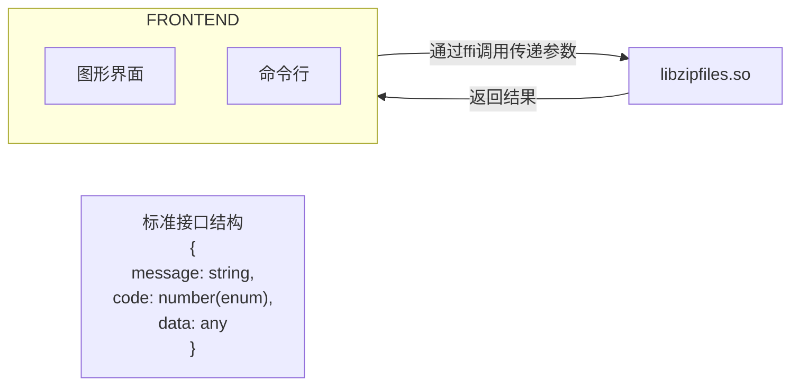
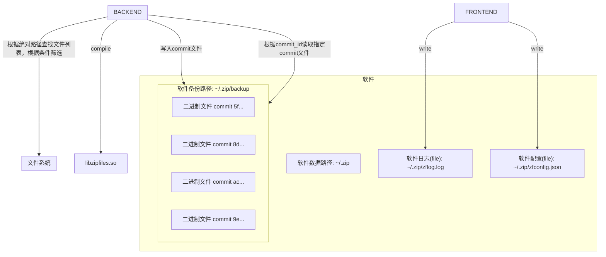
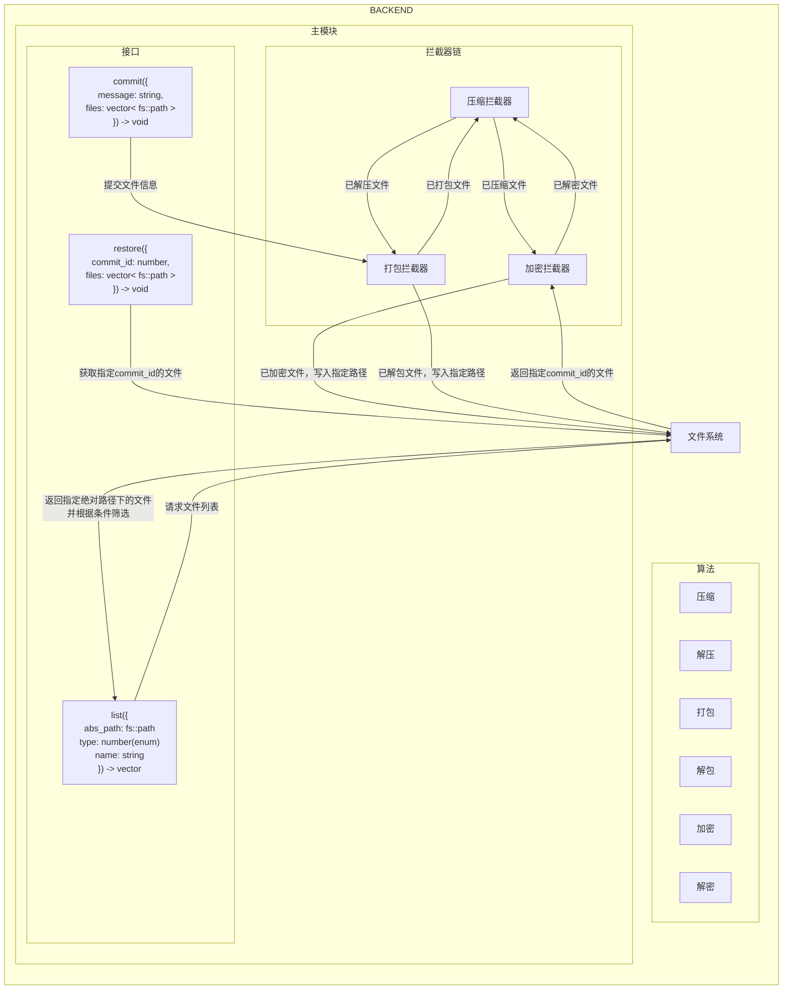

# 项目名称

## 项目简介

## 文件说明

- `demo`: 使用动态链接库的示例代码。
  - `demo.cpp`:主函数入口。
- `include`:头文件目录。
  - `common.h`:通用头文件。
  - `*.h`:核心功能头文件。
  - `utils.h`:工具函数头文件。
  - `unittest_constant.h`:单元测试常量定义。
- `lib`:包含编译生成的二进制文件。
  - `libzipfiles.so`:生成的动态链接库文件。
- `src`:源代码文件目录。
  - `*.cpp`:源代码文件。
  - `utils.cpp`:工具函数实现。
- `tests`: 测试文件目录
  - `unittest/`:单元测试的测试代码目录。
  - `mock/`:单元测试测试时使用的目录。
  - `demo/`:示例代码运行时建议使用的目录。

## 命名空间

- `zipfiles`:主要命名空间。

## 使用方法

TODO 待完善

### 构建项目

```sh
mkdir build
cd build
cmake ..
make
```

## 概要设计

### 架构



> message & code 表示成功或者抛出的异常信息，data 表示返回的数据
> 用于将可能抛出异常的 cpp 函数封装成一个 C 风格的接口
> ps: 这是否是将一个 sum type 转换为了一个 product type





## 打包解包设计

打包解包（10 分）：将所有备份文件拼接为一个大文件保存

git config --global --unset http.proxy
git config --global --unset https.proxy
libjson-glib-dev

linux mq 用于通信的结构体怎么编写，应该不能用指针吧，服务端的指针指向的位置客户端也无法访问  #define MAX_TEXT 512

struct message {
    long msg_type;
    char text[MAX_TEXT];
}; 是可以的  那

struct message {
    long msg_type;
    size_t count;
    char text[count];
};


sudo apt-get install lsb-release wget software-properties-common gnupg
wget https://apt.llvm.org/llvm.sh
chmod +x llvm.sh
sudo ./llvm.sh 18
sudo apt-get update --fix-missing
sudo apt-get install clang-18
sudo update-alternatives --install /usr/bin/clang clang /usr/bin/clang-18 100
sudo update-alternatives --install /usr/bin/clang++ clang++ /usr/bin/clang++-18 100