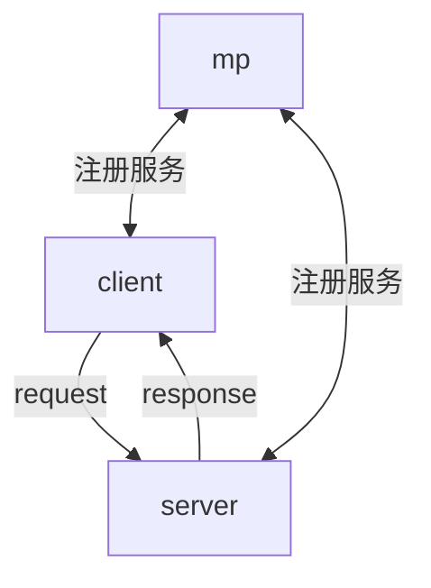
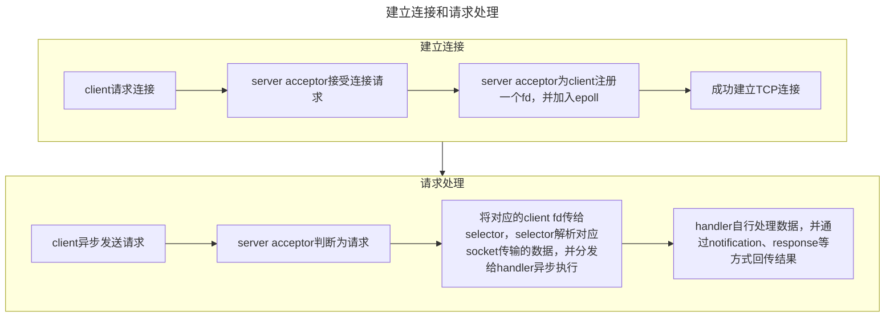
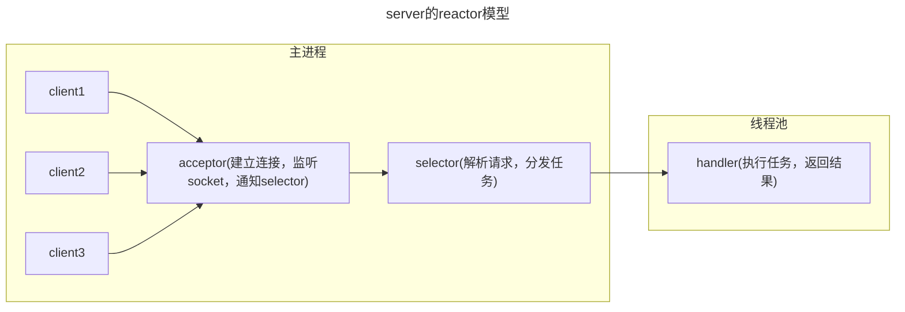

### 项目简介
**zipfiles**

一款为了毕业而开发的课设软件，主要功能是为用户保管和备份文件

基于C++、webKitGTK开发，适用于Linux平台

### 项目特性
支持对目录和文件的打包、压缩、加密，并使用GUI进行方便的管理
使用deflate算法进行多线程压缩、AES256算法进行加密、CRC32进行校验
前后端采用socket通信，理想状态下可处理QPS>2000(视请求复杂度和网络情况而定)

处理速度和压缩率如下
```
处理文件: 2.4GB大小的文本文件(视频、图片等压缩率接近1，故省略其测试结果)
打包-解包: 
压缩-解压: 
加密-解密:
```

### 使用方法
目前暂不支持使用命令行，可以通过启动GUI直接使用
编译后运行bin下的client二进制文件，或者直接使用release版中已经编译好的二进制文件

### 构建项目
TODO Docker构建

编译
```shell
# shell
mkdir build
cd build
cmake .
make
```

### 项目模块

- [x] 数据备份模块(data-backup)
  - [x] 选定备份路径(base)
  - [x] 选定备份文件/目录(add path)
  - [x] 合并成commit(transaction)
  - [x] 生成CRC校验码
  - [x] 备份文件(backup files)
- [x] 数据还原模块(data-restore)
  - [x] 选定还原路径(target)
  - [x] 选定要还原的commit
  - [x] 校验是否正确
  - [x] 还原(restore)
- [x] 数据处理模块(data-processing)
  - [x] 数据打包(pack)
  - [x] 数据解包(unpack)
  - [x] 数据压缩(compress)
  - [x] 数据解压(decompress)
  - [x] 数据加密(encrypt)
  - [x] 数据解密(decrypt)
- [x] UI
  - [ ] shell
  - [ ] GUI
    - [x] 备份
    - [ ] 恢复
    - [ ] 回收站
    - [x] 查看已经提交的commit
    - [ ] 设置
- [ ] 设置模块(configure)
  - [ ] 定时备份(scheduled)
  - [ ] 实时备份(real-time)
  - [ ] 自定义备份(custom backup)
    - [ ] 自定义配置文件
- [x] 工具模块(tools)
  - [x] Linux API
  - [x] 读取目录/文件
    - [x] 文件类型支持(type support)
    - [x] 元数据支持(metadata)
    - [x] 自定义筛选(custom filter)
  - [ ] 哈希(hash)

### 备份流程
1. 添加要备份的文件/目录，形成一个commit
2. 为commit添加author，message，timestamp等信息(生成uuid作为commit的索引)
3. 将所有目标文件打包，压缩，加密，形成一个文件，同时为了可以读取备份后的commit信息，所以额外生成一个目录文件来展示结构
4. 将commit后形成的文件存储在用户指定的文件夹中

### 恢复流程
1. 给定commit uuid和恢复路径，将对应的文件恢复，并重新生成目录结构
2. 恢复后的目录与给定的目录结构合并，但是文件会被覆盖

### 项目架构
总体的模块划分如下



项目的目录结构
(在项目跟目录下运行)
(由于test_files较大，故没有包含在仓库中，因此可以根据目录结构自行创建测试文件，并调整测试中的代码)
```shell
tree -d -I 'build|bin|.cache|.ccls-cache'
.
├── config
├── gui (前端gui，使用webKitGTK实现)
│   ├── dist
│   │   └── static
│   │       ├── css
│   │       ├── fonts
│   │       └── js
│   ├── doc
│   ├── public
│   ├── src
│   │   ├── apis
│   │   │   └── mock
│   │   ├── assets
│   │   │   ├── fonts
│   │   │   └── icons
│   │   │       └── IconGame
│   │   ├── components
│   │   │   └── NotificationList
│   │   ├── contexts
│   │   ├── hooks
│   │   │   ├── useApi
│   │   │   │   ├── development
│   │   │   │   └── production
│   │   │   ├── useDarkMode
│   │   │   └── useWatch
│   │   ├── layouts
│   │   ├── pages
│   │   │   ├── CommitPage
│   │   │   │   ├── Explorer
│   │   │   │   └── store
│   │   │   └── NewCommit
│   │   │       └── Explorer
│   │   ├── router
│   │   ├── stores
│   │   │   └── counter
│   │   ├── types
│   │   └── utils
│   └── test
│       └── jest
├── include (头文件目录)
│   ├── client
│   ├── mp
│   │   └── apis
│   └── server
│       ├── backup
│       ├── configure
│       ├── crypto
│       ├── deflate
│       ├── pack
│       ├── restore
│       ├── socket
│       └── tools
├── script (perf等测试工具使用的脚本)
├── src (源文件目录)
│   ├── client (客户端通信)
│   ├── entry (程序入口)
│   ├── mp (中台)
│   └── server (服务端)
│       ├── backup (备份总流程和用于查看备份文件的directoryfile)
│       ├── configure (一些全局配置)
│       ├── crypto (加密和校验)
│       ├── deflate (压缩和解压)
│       ├── pack (打包和解包)
│       ├── restore (恢复总流程)
│       ├── socket (服务端通信，reactor模型)
│       │   └── apis
│       └── tools (与文件系统相关的接口，commit_table持久化相关，线程池，过滤器)
├── test_files (测试文件)
│   ├── audio
│   ├── doc
│   ├── picture
│   ├── special
│   ├── text
│   │   ├── multi_dir_1
│   │   └── multi_dir_2
│   └── video
├── tests (测试)
│   ├── mock
│   └── server
│       ├── GetCommitDetail
│       ├── backup_and_restore
│       ├── commit_table
│       ├── connection
│       ├── crypto
│       ├── pack
│       └── zip
└── tools (perf等测试工具)
```

### 前后端通信
前后端采用socket进行通信，目前端口和ip地址硬编码在include/client/socket.h中
通信的流程如下





### 压缩文件结构
在打包环节，会生成如下的数据流

| 文件头1 | 文件1的字节流 | 文件头2 | 文件2的字节流 | …   |
| ------- | ------------- | ------- | ------------- | --- |

文件头包含了文件的元信息，例如大小等

之后会按块对数据流进行压缩、加密，并写入输出文件，最后生成CRC32校验码

最后需要在头部加上额外信息

| CRC32校验码 | 加密IV(可选) | 压缩、加密后的文件流 | …   | …   |
| ----------- | ------------ | -------------------- | --- | --- |

同时会生成一个额外的显式记录目录结构的文件，其是一个Json数组

恢复是一个反向操作的过程，即先对文件整体进行CRC校验，之后提取出IV，对文件流进行解密和解压，最后递归地按原来的目录组织结构恢复文件

### 命名空间
- `zipfiles`: 主要命名空间
  - `server`: 服务端命名空间
  - `mp`: 中台命名空间
  - `client`: 客户端命名空间