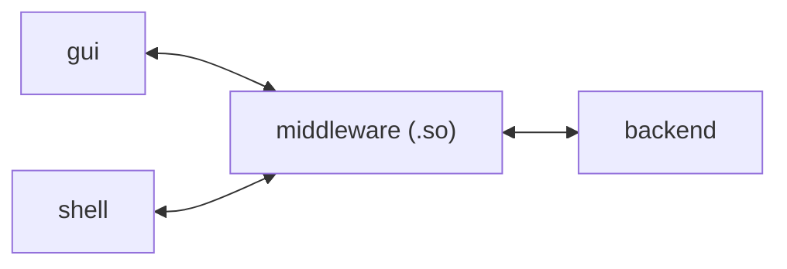

### 项目简介

**zipfiles**

一款为了毕业而开发的课设软件，主要功能是为用户保管和备份文件。

基于C++开发，适用于Linux平台。

### 文件说明

- `bin`:包含编译生成的二进制文件。
  - `libzipfiles.so`:生成的共享库文件。
- `include`:头文件目录。
  - `common.h`:通用头文件。
  - `*.h`:核心功能头文件。
  - `utils.h`:工具函数头文件。
  - `unittest_constant.h`:单元测试常量定义。
- `lib`:包含编译生成的二进制文件。
  - `libzipfiles.so`:生成的动态链接库文件。
- `src`:源代码文件目录。
  - `*.cpp`:源代码文件。
  - `utils.cpp`:工具函数实现。
- `tests`: 测试文件目录
  - `unittest/`:单元测试目录。
- `demo`: 使用动态链接库的示例代码。
  - `main.cpp`:主函数入口。

### 命名空间

- `zipfiles`:主要命名空间。

### 使用方法

TODO 待完善


### 构建项目


```sh
# shell
mkdir build
cd build
cmake .
make
```

### 项目模块

- [ ] 数据备份模块(data-backup)
  - [ ] 选定备份路径(base)
  - [ ] 选定备份文件/目录(add path)
  - [ ] 合并成commit(transaction)
  - [ ] 备份文件(backup files)
- [ ] 数据还原模块(data-recover)
  - [ ] 选定还原路径(target)
  - [ ] 选定要还原的commit
  - [ ] 还原(recover)
- [ ] 数据处理模块(data-processing)
  - [ ] 数据打包(pack)
  - [ ] 数据解包(unpack)
  - [ ] 数据压缩(compress)
  - [ ] 数据解压(decompress)
  - [ ] 数据加密(encrypt)
  - [ ] 数据解密(decrypt)
- [ ] UI
  - [ ] shell
  - [ ] webkitGTK
- [ ] 设置模块(configure)
  - [ ] 定时备份(scheduled)
  - [ ] 实时备份(real-time)
  - [ ] 自定义备份(custom backup)
    - [ ] 自定义配置文件
- [ ] 工具模块(tools)
  - [ ] Linux API
  - [ ] 读取目录/文件
    - [ ] 文件类型支持(type support)
    - [ ] 元数据支持(metadata)
    - [ ] 自定义筛选(custom filter)
  - [ ] 哈希(hash)

### 备份流程

1. 添加要备份的文件/目录，形成一个commit
2. 为commit添加author，message，timestamp等信息（message成为commit的索引）
3. 将所有目标文件压缩，加密，拼接，形成一个文件。同时将这些文件的目录信息，元信息打包成一个结构体，加在文件头
4. 将commit后形成的文件哈希并存储在一个隐藏文件夹中

### 恢复流程

1. 给定commit名和恢复路径，将对应的文件恢复，并重新生成目录结构
2. 恢复后的目录与给定的目录结构合并，但是文件会被覆盖

### 项目架构

总体的模块划分如下


项目的目录结构
```
.
├── build (cmake产物)
├── demo
├── include 
│   ├── common.h
│   ├── client (客户端)
│   ├── mp (中间层)
│   └── server (服务端)
│       ├── backup (文件备份)
│       ├── configure (配置)
│       ├── crypto (加解密)
│       ├── deflate (压缩解压)
│       ├── pack (打包拆包)
│       ├── recover (文件恢复)
│       └── tools (工具类)
├── lib
├── src
│   ├── client
│   ├── mp
│   └── server
│       ├── backup
│       ├── configure
│       ├── crypto
│       ├── deflate
│       ├── pack
│       ├── recover
│       └── tools
└── tests (测试用)
    └── unittest
```


### 压缩文件结构

| 引导块 | 被压缩的文件头1 | 被压缩的文件1的字节流 | 被压缩的文件头2 | 被压缩的文件2的字节流   | …   |
| ------ | --------------------- | --------------------- | --- | --- | --- |

文件头包含了文件的元信息，例如大小等

同时会生成一个额外的显式记录目录结构的文件，其内容是一个数组化的多叉树

目录块的结点结构如下（暂时）
```c
struct node{
  char type;  // 0--目录 1--文件
  long long size; // 文件大小
  int childCount; // 子结点个数，递归遍历用
  struct meta metaInfo; // 元信息
};
```